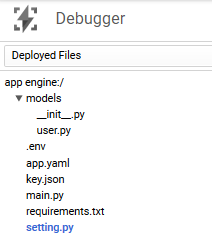
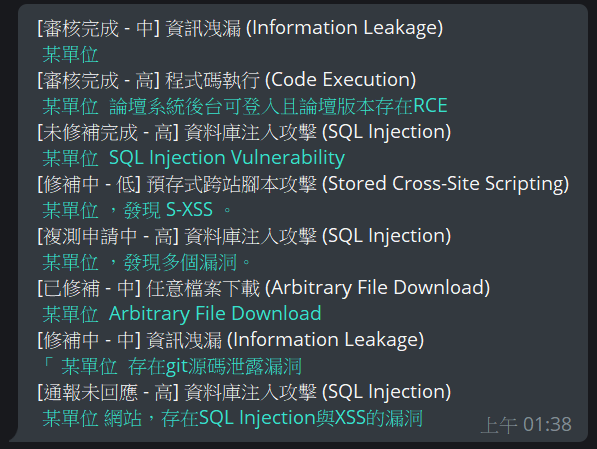
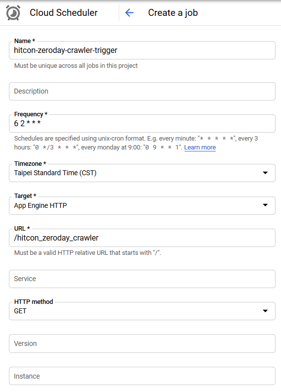
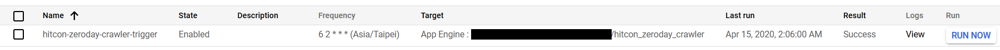
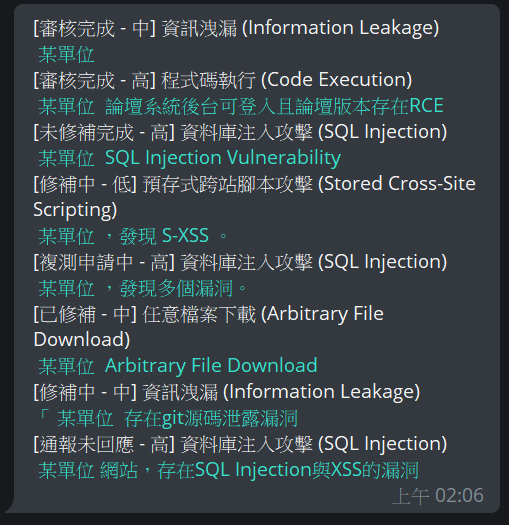

# Telegram Bot with GCP

## Setup local

.env  

```text
BOT_TOKEN={bot token}
```

.local.env  

```text
GOOGLE_APPLICATION_CREDENTIALS={key path}
```

init  

```shell
$ pipenv install
```

## Set up GCP

### Create firestore

Create native mode firestore, gcp path: `/STORAGE/Firestore/Select native mode`  

### Set up authentication

Create Service account that role is owner, and create json type key about this account  

### Deploy GAE

Create requirements.txt  

```shell
$ pipenv lock -r > requirements.txt
```

Create .env file and move key in the project root directory.  

```shell
$ gcloud components install app-engine-go
$ gcloud init # set your project
$ gcloud app deploy
```

and set webhook of Telegram bot:  
`https://api.telegram.org/bot{bot token}/setWebhook?url={target url}/hook`  

PS:  

* bot token is when you create telegram bot, bot father will give you.
* you will see target url when you execute `gcloud app deploy`.

Check remote GAE file structure:  
  

## Use bot

When user join your bot  
  

You will see new user insert you firestore  
  

After user leave your bot  
  

You will see user remove from you firestore  
  


## Hitcon zeroday crawler notification

### Start

Try connect http://127.0.0.1:8080/hitcon_zeroday_crawler  
You will see bot notify zeroday info what last update is yesterday  
  

### Set cloud scheduler on GCP

Open GCP web dashboard  
/ TOOLS / Cloud Scheduler / Create Job  

In this example, I set every 2:06 am, it will connect /hitcon_zeroday_crawler of app engine, when connect this, it will trigger crawler and notify zeroday info to all user who join this bot.  
  
  
  

